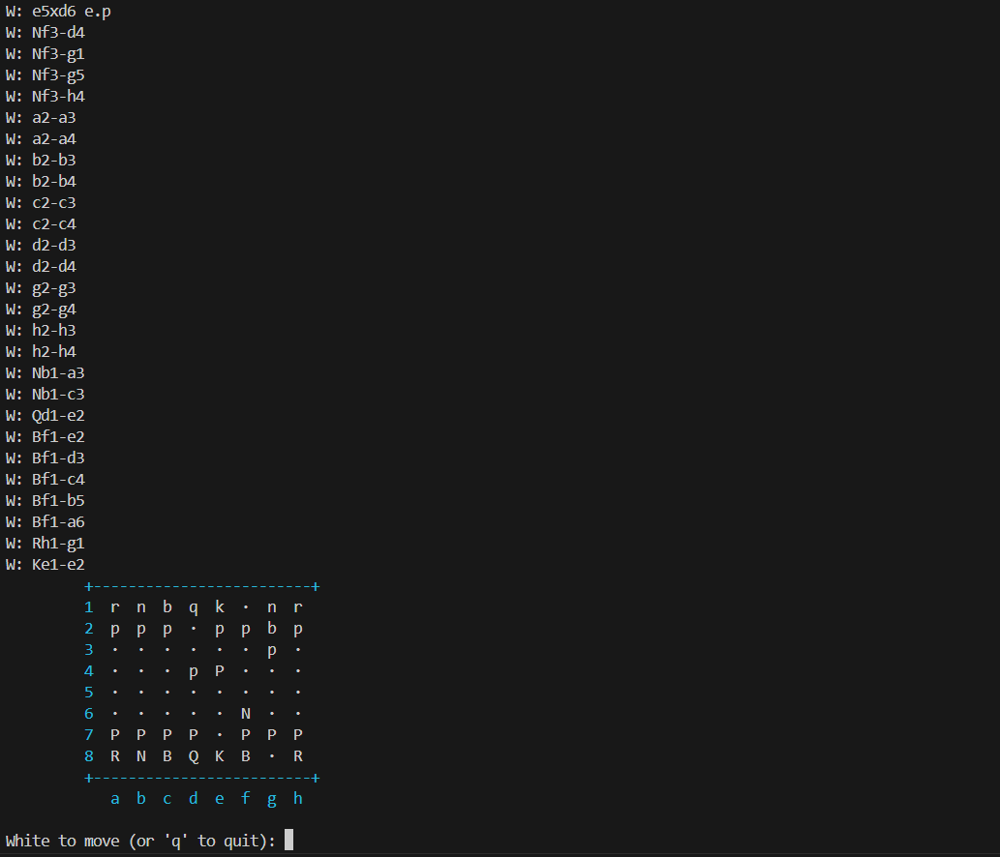

# Chess move generation

**Author: Michał Mizia**

Main goal of this project? Speed. That's why I spent 2 days on writing the code and a week on debugging (Just kidding, the whole project took about 4 days). My goal is to make a multiplayer chess game using asio framework in c++ but first I needed a chess library.

I could have gone with any option currently available, which would work a lot better, faster and save me from a lot of headaches, but hey, I'm stubborn so I decided to roll out my own move generator.

## Slowest move generator
I did not need speed in my project, all I needed was a bug free move generator and I'm pretty sure I have achieved that (only pretty sure because the slow speed would not allow me to test Perft on depth above 5).

So why even showcase this project? Because I feel like it's a great introduction to world of chess programming, there are many confusing things in the deep parts of https://www.chessprogramming.org/
like magic bitboard, 8x12 boards, 0x88 algorithms and so on. My goal was to be as simple as possible while creating something functional (with working en passant rules).

By looking at this code, you can get some intuition behind the basics of move generation, so give It a go and see if you'll get drawn into the world of chess programming.

## How to build
```bash
    mkdir build
    cd build
    cmake ..
    make

    # to play a game
    ./main
```

## Base classes

### Piece.cpp

Class so simple that it did not even need a header file. Used to represent a piece using bitmasks.

In this project, chess board is represented as an array of 64 integers, where each represents a piece

### Move.h - Move.cpp

Move with start square, end square, Piece on the start square and flags like en passant, castle etc.

### GameState.h - GameState.cpp

Used to contain the board and important game information like en passant target, castling rights, move history, move counter etc. Has methods of making moves, undoing the previous move, generating all legal moves and generating pseudolegal moves for each piece type.

## Example:

